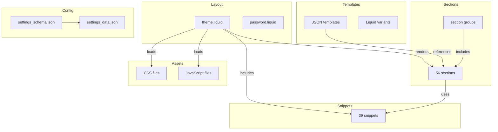

# BeeClean-er

A Shopify theme based on [Dawn](https://github.com/Shopify/dawn) (v15.4.1), Shopify's reference theme for Online Store 2.0.

[](https://github.com/gitjuicy/beeclean-er/actions)
[](.github/CONTRIBUTING.md)

[Getting started](#getting-started) |
[Architecture](#architecture) |
[Developer tools](#developer-tools) |
[Localization](#localization) |
[Resources](#resources) |
[License](#license)

## Getting Started

### Prerequisites

- [Shopify CLI](https://shopify.dev/docs/themes/tools/cli) installed
- A Shopify store or [development store](https://help.shopify.com/en/manual/apps/development-stores)

### Local Development

```bash
# Connect to a store and start development server
shopify theme dev --store your-store.myshopify.com

# Push theme to a specific environment
shopify theme push --environment development

# Pull theme from store to local
shopify theme pull --environment development
```

This theme follows Dawn's core principles:

- **Web-native**: Leverages evergreen web standards; no polyfills
- **Server-rendered**: HTML rendered by Shopify servers using Liquid
- **Progressive Enhancement**: JavaScript used only when needed
- **Functional over Pixel-Perfect**: Semantic markup ensures cross-browser compatibility

## Architecture

### Directory Structure

| Path | Count | Purpose |
|------|-------|---------|
| `assets/` | 187 | CSS, JS, images, fonts |
| `sections/` | 56 | Theme sections (modular, merchant-customizable) |
| `snippets/` | 39 | Reusable Liquid partials |
| `templates/` | 16 | Page type templates plus JSON variants |
| `locales/` | 53 | Translation files |

### Key Sections

| Section | File | Function |
|---------|------|----------|
| Header | `sections/header.liquid` | Site header with navigation |
| Footer | `sections/footer.liquid` | Site footer |
| Main Product | `sections/main-product.liquid` | Product detail page |
| Main Collection | `sections/main-collection-product-grid.liquid` | Collection/product grid |
| Cart Drawer | `sections/cart-drawer.liquid` | Slide-out cart |
| Featured Collection | `sections/featured-collection.liquid` | Featured products |
| Image Banner | `sections/image-banner.liquid` | Full-width image banner |
| Slideshow | `sections/slideshow.liquid` | Hero slideshow |

### Key Snippets

| Snippet | Purpose |
|---------|---------|
| `buy-buttons.liquid` | Add to cart buttons |
| `price.liquid` | Price formatting |
| `product-media.liquid` | Product images/videos |
| `card-product.liquid` | Product card display |
| `variant-picker.liquid` | Product variant selection |
| `cart-drawer.liquid` | Cart drawer content |

### Theme Architecture



## Developer Tools

### Linting

```bash
# Run Theme Check (linter for Liquid)
shopify theme check
```

### Formatting

```bash
# Prettier for JSON/JS/CSS
npx prettier --write .
```

### VS Code Extensions

Recommended extensions (defined in `.vscode/extensions.json`):

- `shopify.theme-check-vscode` - Liquid linting
- `esbenp.prettier-vscode` - Code formatting

## Localization

This theme supports 30+ languages via `locales/` directory:

- **European**: de, es, fr, it, nl, pl, pt-BR, pt-PT, sv, da, fi, el, cs, sk, hu, sl, hr, lt, ro, bg
- **Asian**: zh-CN, zh-TW, ja, ko, vi, th, id
- **Nordic**: nb (Norwegian Bokmål)
- **Other**: ru, tr

## Resources

- [Shopify Theme Documentation](https://help.shopify.com/en/manual/online-store/themes)
- [Dawn Theme GitHub](https://github.com/Shopify/dawn)
- [Shopify CLI Reference](https://shopify.dev/docs/themes/tools/cli)

## License

Copyright (c) 2024-present. See [LICENSE.md](./LICENSE.md) for details.